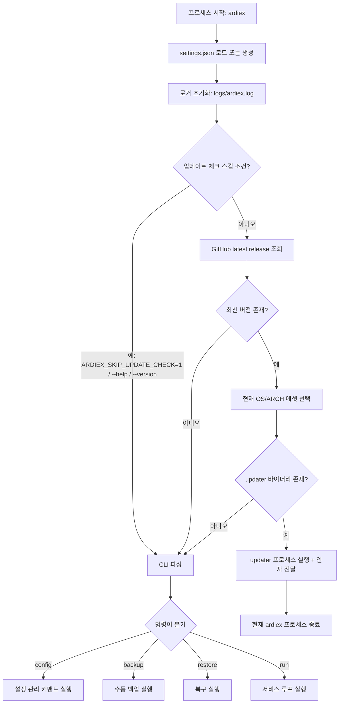
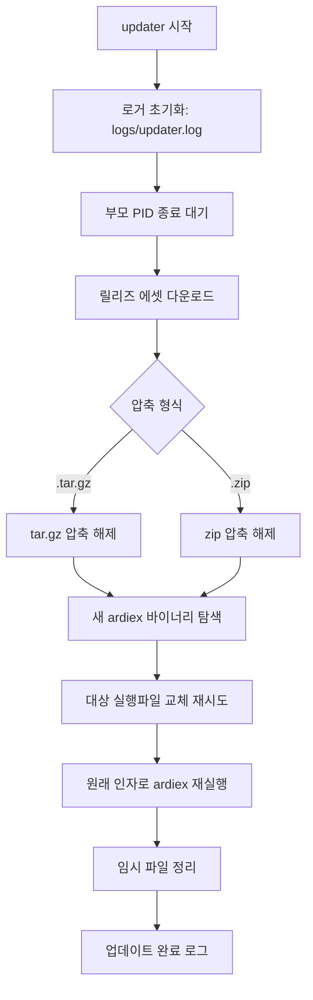
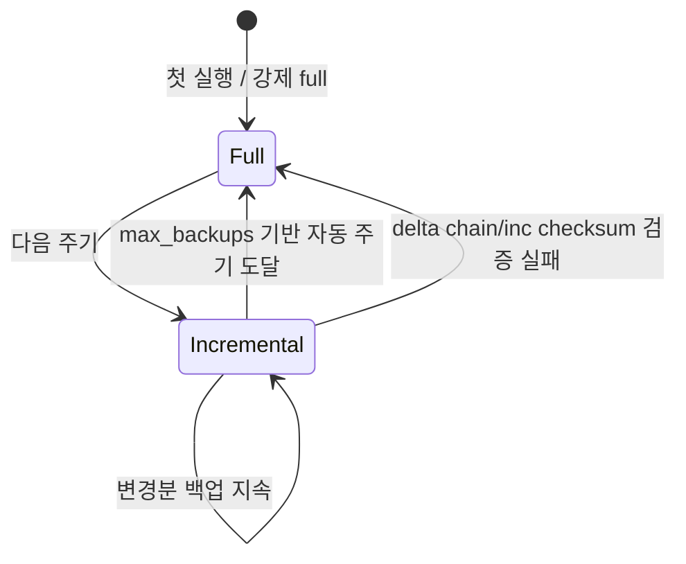

# Ardiex 실행 로직 전체 다이어그램

이 문서는 `ardiex`의 실행 경로를 한 번에 확인할 수 있도록 mermaid 다이어그램으로 정리한 문서입니다.

## 1) 메인 실행 흐름 (`ardiex`)



## 2) 업데이트 위임/교체 흐름 (`updater`)



## 3) 백업 실행 흐름 (`backup` / `run` 공통 백업 엔진)

```mermaid
flowchart TD
    A[validate_all_sources] --> B[소스/백업경로/cron/metadata 검증]
    B --> C[force_full 여부 계산]
    C --> D[backup_all_sources]
    D --> E[소스별 반복]
    E --> F[백업 경로별 반복]
    F --> G{이번 백업 타입 결정}

    G -->|force_full=true 또는 full 필요| H[full_타임스탬프 디렉토리 생성]
    G -->|incremental 가능| I[inc_타임스탬프 디렉토리 생성]

    H --> J[변경 파일 스캔 + 복사]
    I --> K{backup_mode}
    K -->|delta| L[이전 파일 비교 후 .delta 생성]
    K -->|copy| M[변경 파일 전체 복사]

    J --> N[metadata 업데이트]
    L --> N
    M --> N
    N --> O[inc_checksum 기록/검증 정보 동기화]
    O --> P[보관 정책(max_backups) 정리]
    P --> Q[완료 로그 + 결과 반환]
```

## 4) 서비스 루프 흐름 (`run`)

```mermaid
flowchart TD
    A[run 시작] --> B[초기 설정 로드 + validate_all_sources]
    B --> C[[CONFIG] pretty JSON 출력]
    C --> D[cron task / watcher task 생성]
    D --> E{tokio select 루프}

    E -->|backup trigger 수신| F[backup_all_sources 실행]
    F --> E

    E -->|2초 reload tick| G[settings.json 재로드]
    G --> H{fingerprint 변경?}
    H -->|아니오| E
    H -->|예| I[신규 설정 검증]
    I --> J{유효성}
    J -->|유효| K[기존 task 중단 후 신규 task 교체]
    K --> L[[HOT-RELOAD] Applied + [CONFIG] 출력]
    L --> E
    J -->|무효| M[[HOT-RELOAD] Rejected 로그]
    M --> E

    E -->|Ctrl+C| N[task 정리 후 종료]
```

## 5) 실행 모드 관계 요약


